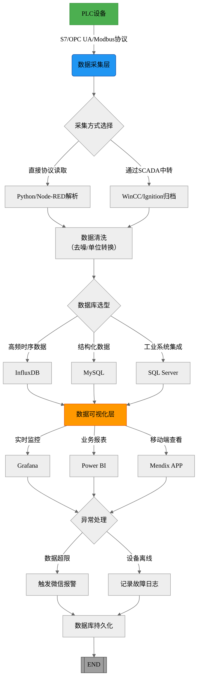

流程图说明
采集层

紫色模块：协议选择（西门子S7/OPC UA最常用）
蓝色分支：直接代码采集 vs SCADA中转
存储层

橙色决策框：根据数据类型选择数据库
InfluxDB适合振动频率等高频数据，MySQL适合工单记录
可视化层

黄色模块：不同工具侧重不同场景
Grafana实时看板效果示例：
Grafana面板

25.3℃

Unsupported markdown: blockquote
当前温度

绿色

红色报警

异常处理

红色路径：触发即时报警（微信/短信）
灰色路径：日志记录用于事后分析
关键点标注
绿色模块：物理设备层（PLC/传感器）
蓝色模块：数据流处理层
橙色模块：业务决策点
灰色模块：终止节点