# 工业软件与数字化转型详解

## 引言

本篇文档旨在为您提供一份关于工业软件和制造业数字化转型的综合性知识梳理，**尤其关注其在中国传统制造业中的应用与实践与挑战**。内容涵盖了核心概念、关键技术、主流系统、市场格局（包括代表性厂商和案例，**并侧重分析国内发展情况与特色**）以及企业在数字化转型过程中的潜在机遇与挑战。希望通过这份材料，帮助您更深入地理解这一复杂领域，并为成都瑞途电子的战略发展提供有价值的参考。

## 核心知识树

```mermaid
graph TD
    A[工业软件与数字化转型] --> B{数字化转型认知};
    A --> C{工业软件核心体系};
    A --> D{成都瑞途电子的机遇};
    A --> E{工业软件分类与选型};

    B --> B1[定义与目标: 提升效率, 创新模式, 增强竞争力];
    B --> B2[为何转型? &#40;驱动因素: 市场竞争, 客户需求个性化, 技术进步, 政策引导&#41;];
    B --> B3[转型路径思考: 顶层设计, 试点先行, 持续优化, 人才培养];

    C --> C1_Cat[按功能域划分关键软件类型];
    C --> C2_Concept[核心理念与集成];

    C1_Cat --> RD_Design[研发设计类软件];
    RD_Design --> PLM[PLM 产品生命周期管理];
    RD_Design --> CAD[CAD 计算机辅助设计];
    RD_Design --> CAE[CAE 计算机辅助工程];
    RD_Design --> CAM[CAM 计算机辅助制造];
    RD_Design --> EDA[EDA 电子设计自动化 &#40;针对电子行业&#41;];

    C1_Cat --> Production_Mgmt[生产管控类软件];
    Production_Mgmt --> ERP[ERP 企业资源计划];
    Production_Mgmt --> MES[MES 制造执行系统];
    Production_Mgmt --> WMS[WMS 仓库管理系统];
    Production_Mgmt --> APS[APS 先进规划与排程系统];
    Production_Mgmt --> QMS[QMS 质量管理系统];
    Production_Mgmt --> EAM[EAM 企业资产管理/MRO 维护维修];

    C1_Cat --> Operation_Support[运营支撑与协同类软件];
    Operation_Support --> SCM[SCM 供应链管理];
    Operation_Support --> CRM[CRM 客户关系管理];
    Operation_Support --> SRM[SRM 供应商关系管理];
    Operation_Support --> BI_Analytics[BI 商业智能与数据分析];

    C1_Cat --> Platform_Connectivity[平台与连接类];
    Platform_Connectivity --> IIoT[工业互联网平台 &#40;PaaS&#41;];
    Platform_Connectivity --> SCADA_DCS[SCADA/DCS 数据采集与监视控制系统/分布式控制系统];
    Platform_Connectivity --> EdgeComputing[边缘计算平台];

    C2_Concept --> ICS[大集控系统 Integrated Control Systems];
    ICS --> ICS_Def[定义: 整合IT与OT, 全流程集中监控、统一调度与数据协同];
    ICS --> ICS_Func[功能: 实时监控, 远程操作, 报警管理, 能源管理, 生产指挥];
    ICS --> ICS_Relation[与SCADA/DCS/MES关系: SCADA/DCS是数据来源和执行单元, MES是车间级核心, 大集控是更高层级或跨车间/工厂的集成];
    ICS --> ICS_Case[案例: 大型流程制造企业&#40;如石化、电力&#41;通过大集控中心实现多工厂集中运营];

    C2_Concept --> DT[数字孪生 Digital Twin];
    DT --> DT_Def[定义: 物理实体的动态虚拟映射, 具备数据/模型/知识驱动特性];
    DT --> DT_Value[价值: 设计优化, 仿真验证, 过程监控/预测, 预测性维护, 虚拟调试, 培训];
    DT --> DT_Elements[构建要素: 物理实体, 传感与连接, 数据, 模型&#40;几何/物理/行为/规则&#41;, 软件平台, 应用服务];
    DT --> DT_ICS_Link[与大集控/IIoT协同: IIoT/大集控提供实时数据流, 数字孪生进行建模、仿真、分析与可视化展现];
    DT --> DT_Vendors[代表厂商/平台: Siemens &#40;Industrial Digital Twin&#41;, GE Digital &#40;Digital Twin&#41;, Dassault Systèmes &#40;3DEXPERIENCE&#41;, Ansys, PTC. 行业解决方案也常见, 如Bentley &#40;基础设施&#41;];
    DT --> DT_Case[案例: 风力发电机组数字孪生用于远程监控和预测性维护; 汽车工厂产线数字孪生用于生产优化和虚拟调试];

    D --> D1[从硬件&#40;如控制器、传感器&#41;到&quot;硬件+软件+服务&quot;的转型];
    D --> D2[基于现有硬件的软件增值: 如嵌入式软件升级, 数据采集与分析应用开发];
    D --> D3[系统集成与优化服务: 帮助客户打通现有系统&#40;如ERP, MES, PLC&#41;, 提升整体效率];
    D --> D4[定制化软件开发: 针对客户特定需求的MES/WMS模块开发, 行业特定应用开发];
    D --> D5[数据分析与AI应用: 如基于设备数据的故障预测, 基于生产数据的质量分析与优化];
    D --> D6[咨询服务: 数字化转型规划, 工业软件选型与实施策略];

    E --> E1[分类标准探讨: 功能域&#40;最常用&#41;、企业层级、行业特性、技术架构];
    E --> E2[细颗粒度分类示例 &#40;已在术语解释中详述,此处不再展开&#41;];
    E --> E3[选型考量因素: 业务需求匹配度, 技术先进性与成熟度, 可扩展性, 集成能力, 供应商实力与服务, 总体拥有成本&#40;TCO&#41;, 行业案例];
    E --> E4[竞品分析维度: 功能覆盖, 技术架构, 价格, 客户口碑, 行业经验, 生态系统];

    subgraph ERP_Details [ERP 企业资源计划]
        direction LR
        ERP_Def[定义: 管理企业核心业务流程&#40;财/物/产/供/销/人&#41;]
        ERP_Func[核心模块: FI/CO, MM, SD, PP, HR, QM等]
        ERP_Integration[ERP集成: 与MES/WMS/CRM/PLM等打通数据流与业务流. 是数字化工厂的神经中枢之一.]
        ERP_Vendors_Global[国际厂商: SAP &#40;S/4HANA&#41;, Oracle &#40;NetSuite, Fusion Cloud ERP&#41;, Microsoft &#40;Dynamics 365&#41;]
        ERP_Vendors_Local[国内厂商: 用友 &#40;YonSuite, U9 Cloud&#41;, 金蝶 &#40;苍穹, K/3 Cloud&#41;,浪潮,鼎捷]
        ERP_Case_Example[案例: 装备制造企业ERP实现项目制造精细化成本与供应链协同.]
    end
    ERP --> ERP_Details;

    subgraph MES_Details [MES 制造执行系统]
        direction LR
        MES_Def[定义: 连接计划层与控制层,管理车间从订单到成品的执行过程]
        MES_Func[核心功能: 生产调度, 过程控制, 质量管理, 设备管理&#40;OEE&#41;, 物料追溯, 数据采集, 人员管理, 在制品管理]
        MES_Custom[MES定制: 针对特定行业&#40;如电子、汽车、医药GMP&#41;的合规性要求、独特工艺流程、设备接口、报表等进行个性化开发.]
        MES_Vendors_Global[国际厂商: Siemens &#40;Opcenter&#41;, Dassault Systèmes &#40;DELMIA Apriso&#41;, Rockwell Automation &#40;FactoryTalk ProductionCentre&#41;, GE Digital &#40;Proficy&#41;, SAP ME/MII, AVEVA MES]
        MES_Vendors_Local[国内厂商: 宝信软件 &#40;xIn3Plat&#41;, 中控技术 &#40;SupOS&#41;, 盘古信息, 摩尔元数, 黑湖科技, 华磊迅拓等]
        MES_Case_Example[案例: 汽车零部件厂MES实现JIT/JIS, 提OEE, 严格追溯.]
    end
    MES --> MES_Details;

    subgraph WMS_Details [WMS 仓库管理系统]
        direction LR
        WMS_Def[定义: 优化仓库作业&#40;入库/出库/库存/盘点&#41;,提升效率与准确性]
        WMS_Func[核心功能: 收货/上架策略, 拣货策略&#40;波次/订单/RF&#41;, 补货, 盘点, 库位管理, RF作业, 与自动化设备&#40;AGV/ASRS&#41;集成]
        WMS_Custom[WMS定制: 针对仓库布局、SKU特性、自动化程度、温控/批次等特殊管理需求进行定制. 与TMS/OMS集成.]
        WMS_Vendors_Global[国际厂商: Manhattan Associates &#40;WMS&#41;, Blue Yonder &#40;JDA WMS&#41;, Oracle &#40;WMS Cloud&#41;, SAP &#40;EWM Extended Warehouse Management&#41;, Infor WMS]
        WMS_Vendors_Local[国内厂商: 科箭软件 &#40;Power WMS&#41;, 唯智信息 &#40;vTradEx WMS&#41;, 网仓科技, 心怡科技, 巨沃]
        WMS_Case_Example[案例: 电商配送中心WMS+自动化高效拣选发货, 库存准确率99.9%.]
    end
    WMS --> WMS_Details;

    subgraph PLM_Details [PLM 产品生命周期管理]
        direction LR
        PLM_Def[定义: 管理产品从概念、设计、制造、服务到报废的全生命周期数据和流程]
        PLM_Func[核心功能: PDM&#40;数据/文档/BOM/变更管理&#41;, CAD/CAE/CAM集成, 项目管理, 需求管理, 工艺管理&#40;MBOM/BOP&#41;, 合规管理]
        PLM_Vendors[主流厂商: Siemens &#40;Teamcenter&#41;, Dassault Systèmes &#40;ENOVIA/3DEXPERIENCE&#41;, PTC &#40;Windchill&#41;, Autodesk &#40;Fusion 360 Manage/Vault&#41;, Aras Innovator]
        PLM_Case_Example[案例: 航空航天企业PLM管理复杂BOM/变更, 协同供应商.]
    end
    PLM --> PLM_Details;

    subgraph APS_Details [APS 先进规划与排程系统]
        direction LR
        APS_Def[定义: 基于约束理论和优化算法, 进行中长期生产计划和短期详细排程]
        APS_Func[核心功能: 有限产能排程, 多工厂计划, 需求预测与S&OP支持, 物料约束, 优化目标&#40;如交期/成本/换型&#41;]
        APS_Vendors[主流厂商: Dassault Systèmes &#40;Quintiq, Ortems&#41;, Siemens &#40;Opcenter APS/Preactor&#41;, Asprova, SAP IBP/PP/DS, o9 Solutions, Kinaxis]
        APS_Case_Example[案例: 定制家具厂APS应对个性化订单, 缩短周期, 提高设备利用率.]
    end
    APS --> APS_Details;

    subgraph IIoT_Details [工业互联网平台]
        direction LR
        IIoT_Def[定义: 提供工业设备连接、数据采集、存储、分析与工业APP开发部署的PaaS平台]
        IIoT_Func[核心功能: 设备接入/管理, 数据湖/时序库, 数据建模, AI/ML库, 微服务, APP开发, 可视化]
        IIoT_Vendors_Global[国际平台: Siemens &#40;MindSphere&#41;, GE Digital &#40;Predix&#41;, Microsoft &#40;Azure IoT&#41;, AWS &#40;AWS IoT&#41;, PTC &#40;ThingWorx&#41;, Software AG &#40;Cumulocity IoT&#41;]
        IIoT_Vendors_Local[国内平台: 阿里云 &#40;Link IoT Edge&#41;, 腾讯云 &#40;IoT Hub&#41;, 华为云 &#40;IoTDA&#41;, 树根互联 &#40;根云&#41;, 用友 &#40;YonBIP IoT&#41;, 浪潮 &#40;云洲&#41;, 美的 &#40;M.IoT&#41;, 海尔 &#40;COSMOPlat&#41;]
        IIoT_Case_Example[案例: 工程机械远程监测、故障诊断、预测性维护, 开拓服务收入.]
    end
    IIoT --> IIoT_Details;
```

## 一、数字化转型认知

### 1.1 定义与目标
数字化转型是指企业利用数字技术（如云计算、大数据、人工智能、物联网、移动互联网等）来根本性地改变其业务流程、组织架构、企业文化和商业模式，以创造新的客户价值并获得持续竞争优势的过程。

**核心目标：**
*   **效率提升：** 优化内部流程，降低运营成本，提高生产效率和资源利用率。
*   **模式创新：** 开发新的产品、服务或商业模式，拓展新的收入来源。
*   **客户体验增强：** 更精准地理解客户需求，提供个性化的产品和服务，提升客户满意度和忠诚度。
*   **决策智能化：** 基于数据驱动的洞察，提升决策的科学性和时效性。
*   **组织敏捷性：** 增强企业对市场变化的快速响应能力和适应性。
*   **可持续发展：** 通过节能降耗、绿色制造等方式，助力企业实现可持续发展目标。

### 1.2 为何转型？（驱动因素）
*   **市场竞争加剧：** 全球化竞争和新兴企业的涌现，迫使传统企业寻求变革以保持领先；**国内市场同质化竞争激烈，利润空间压缩，亟需通过数字化转型提升差异化竞争力。**
*   **客户需求个性化与多样化：** 客户不再满足于标准化产品，对定制化、快速交付和优质体验的需求日益增长，**倒逼中国制造企业提升柔性生产和快速响应能力。**
*   **技术进步与普及：** 新兴数字技术的成熟和成本降低，为转型提供了技术可行性，**云计算、大数据、AI、IoT等技术在国内加速渗透。**
*   **政策引导与支持：** **中国政府大力推动制造业升级，相继出台"中国制造2025"、"新基建"、"智能制造发展规划"、"工业互联网创新发展行动计划"等一系列国家战略和扶持政策，为传统制造业的数字化转型提供了明确的导向和良好的外部环境。**
*   **产业链协同要求：** 数字化水平较高的核心企业会带动上下游企业进行数字化改造，以实现整个产业链的效率提升。**中国作为全球制造中心，产业链上下游协同的数字化需求日益迫切。**
*   **内部成本与效率压力：** **随着中国劳动力、土地等要素成本的持续上升、原材料价格波动以及对生产效率和产品质量要求的不断提高，传统制造业面临着通过数字化手段降本增效、提升核心竞争力的迫切需求。**

### 1.3 转型路径思考
数字化转型并非一蹴而就，需要系统规划和分步实施。**对于中国传统制造企业，尤其需要结合自身实际，选择合适的路径：**
*   **顶层设计与战略规划：** 结合企业自身特点和行业发展趋势，明确数字化转型的愿景与目标，**充分考虑中国市场的具体情况和国家政策导向（如与"智能制造"、"工业互联网创新发展"等国家战略的对齐），制定务实可行的实施路线图，避免盲目跟风。**
*   **试点先行与价值导向：** **尤其对于资金、技术和人才基础相对薄弱的中国传统制造企业（特别是量大面广的中小企业），** 建议选择痛点突出、易于见效、投资回报周期短的业务场景（如生产过程透明化、设备状态监测、质量追溯、仓储优化等）进行试点，快速验证方案的可行性和效益，**以点带面，小步快跑，逐步推广，确保转型投入能快速产生实际业务价值。**
*   **数据驱动与持续优化：** 逐步建立覆盖生产、运营、管理全流程的数据采集、治理、分析和应用能力，以数据洞察驱动决策优化和业务创新，**转型始终以提升效率、降低成本、提高质量、增强客户满意度等核心业务指标为导向，避免为数字化而数字化。**
*   **强化人才培养与组织变革：** **认识到人才是数字化转型的核心要素，积极培养既懂业务又懂数字技术的复合型人才，例如通过内部培训、外部引进、与职业院校合作等多种方式。** 相应地调整组织架构以适应数字化运营模式，鼓励跨部门协作，培育支持创新和变革的企业文化。
*   **开放合作与生态共建：** **积极与国内外的技术提供商、系统集成商、科研院所、行业平台及地方政府产业集群资源开展合作，** 借鉴成功经验，整合优质资源（包括国家和地方的专项资金、试点项目等），共同推动转型向纵深发展，**积极融入区域和行业的数字化生态。**
*   **夯实自动化与精益基础：** **对于许多中国传统制造企业而言，数字化转型应建立在一定的自动化和精益生产基础之上。首先优化现有流程，消除浪费，提高自动化水平，再通过数字化技术赋能，才能事半功倍。**

## 二、工业软硬件层级架构参考 (ISA-95模型)

为了更清晰地理解工业体系中不同软硬件的定位及其相互关系，我们可以参考经典的ISA-95模型（企业与控制系统集成的国际标准）所定义的层级架构。下图展示了一个简化的工业软硬件层级视图：

```mermaid
graph TD
    subgraph L4_L5 [L4/L5: 企业管理与规划层 - Business Planning & Logistics]
        direction LR
        ERP_Sys[ERP 企业资源计划]
        PLM_Sys[PLM 产品生命周期管理]
        SCM_Sys[SCM 供应链管理]
        CRM_Sys[CRM 客户关系管理]
        SRM_Sys[SRM 供应商关系管理]
        BI_Sys[BI 商业智能与数据分析]
        Cloud_IIoT_Platform[云端IIoT平台/企业级应用服务]
        LCAP_Enterprise[低代码平台 （企业级应用）]
        L4_HW[硬件: 企业服务器, 数据中心, 云基础设施]
    end

    subgraph L3 [L3: 制造运营管理层 - Manufacturing Operations Management （MOM）]
        direction LR
        MES_Sys[MES 制造执行系统]
        APS_Sys[APS 先进规划与排程]
        QMS_Sys[QMS 质量管理系统]
        WMS_Sys[WMS 仓库管理系统]
        EAM_CMMS[EAM/CMMS 企业资产/维护管理]
        EMI_Sys[EMI 制造智能]
        LIMS_Sys[LIMS 实验室信息管理]
        L3_HW[硬件: MOM应用服务器, 工业平板, 车间终端]
    end

    subgraph L2 [L2: 过程监控与HMI层 - Supervisory Control & HMI]
        direction LR
        SCADA_Sys[SCADA 数据采集与监控系统]
        HMI_Central[中央HMI/操作站]
        Edge_Platform[边缘计算平台/网关]
        Historian_DB[实时/历史数据库]
        L2_HW[硬件: SCADA服务器, HMI触摸屏, 边缘计算设备, 工业网络设备]
    end

    subgraph L1 [L1: 控制层 - Control Level]
        direction LR
        PLC_Ctrl[PLC 可编程逻辑控制器]
        DCS_Ctrl[DCS 分布式控制系统单元]
        Motion_Ctrl[运动控制器/伺服驱动器]
        RTU_Ctrl[RTU 远程终端单元]
        Safety_Ctrl[安全控制器]
        L1_HW[硬件: PLC/DCS模块, 驱动器, 工业PC（控制）, I/O模块]
        L1_SW[软件: PLC/DCS编程组态软件, HMI组态软件（本地）]
    end

    subgraph L0 [L0: 物理设备层 - Physical/Field Level]
        direction LR
        Sensors[传感器 （如温度、压力、位移、视觉）]
        Actuators[执行器 （如阀门、电机、气缸）]
        Robots[机器人本体/末端执行器]
        Production_Machines[各类生产设备/机床]
        Smart_Instruments[智能仪表]
        L0_EmbeddedSW[嵌入式软件/固件 （运行于设备内部）]
    end

    L4_L5 --> L3
    L3 --> L2
    L2 --> L1
    L1 --> L0
```

**各层级说明：**

*   **L0 (物理设备层 - Physical/Field Level):** 这是生产过程的物理基础，包含直接参与或感知生产过程的各类设备。
    *   **典型硬件：** 传感器、执行器、机器人、生产机床、智能仪表等。
    *   **典型软件：** 主要指运行在这些硬件内部的嵌入式软件或固件，用于实现设备的基本功能和数据采集。

*   **L1 (控制层 - Control Level):** 负责直接控制L0的设备，实现自动化的操作和响应。
    *   **典型硬件：** PLC (可编程逻辑控制器)、DCS (分布式控制系统) 的控制模块、运动控制器、驱动器、工业PC (用于直接控制)、I/O模块、安全控制器。
    *   **典型软件：** PLC/DCS的编程和组态软件 (如Siemens TIA Portal, Rockwell Studio 5000)，本地HMI的组态软件 (用于设备级的操作界面)。

*   **L2 (过程监控与HMI层 - Supervisory Control & HMI):** 对L1的控制过程进行集中的监控、数据采集和操作员交互。
    *   **典型硬件：** SCADA服务器、HMI触摸屏 (用于中央监控)、边缘计算设备/网关、工业网络设备 (交换机、路由器)。
    *   **典型软件：** SCADA系统软件 (如Siemens WinCC, AVEVA InTouch/System Platform, Rockwell FactoryTalk View SE)、集中HMI软件、实时数据库/历史数据库 (Historian)、边缘计算平台的管理和应用软件。

*   **L3 (制造运营管理层 - Manufacturing Operations Management - MOM):** 管理从订单到成品交付的整个车间生产活动，是连接企业计划层和工厂控制层的桥梁。
    *   **典型硬件：** MES等MOM应用服务器、供车间人员使用的工业平板或固定终端。
    *   **典型软件：** MES (制造执行系统)、APS (先进规划与排程)、QMS (质量管理系统)、WMS (仓库管理系统)、EAM/CMMS (企业资产管理/维护管理系统)、LIMS (实验室信息管理系统)、EMI (制造智能)等。

*   **L4/L5 (企业管理与规划层 - Business Planning & Logistics):** 负责企业级的业务运营、战略规划和资源管理。
    *   **典型硬件：** ERP等企业级应用服务器、企业数据中心、云平台基础设施。
    *   **典型软件：** ERP (企业资源计划)、PLM (产品生命周期管理)、SCM (供应链管理)、CRM (客户关系管理)、SRM (供应商关系管理)、BI (商业智能与数据分析)、企业级IIoT平台应用与服务、低代码应用平台 (用于开发企业级业务应用)。

**如何利用此层级图与成都瑞途电子进行讨论：**

这份层级架构图可以作为一个非常有效的沟通工具，帮助成都瑞途电子梳理其当前的业务和未来的发展方向：

1.  **明确定位现有产品：**
    *   首先，可以请瑞途电子将其现有的硬件产品（如控制器、传感器等）对应到这个层级图的L0和L1层。例如，他们的传感器属于L0，控制器可能属于L1。
    *   了解这些硬件产品目前配套了哪些嵌入式软件或固件 (L0/L1的软件部分)，以及这些软件具备哪些功能（如数据采集协议、边缘处理能力、控制逻辑等）。

2.  **分析现有软件能力与差距：**
    *   基于其硬件定位，评估瑞途电子在L0和L1层级的软件能力，例如，其控制器编程的易用性、开放性，传感器数据的预处理能力等。
    *   识别在这些层级中，对比业界领先实践，瑞途电子的软件部分是否存在可以增强或提升的方面。

3.  **探索向上层软件拓展的机会：**
    *   **L2层机会：** 瑞途电子的硬件（尤其是控制器和带通讯能力的传感器）可以直接为L2层的SCADA系统或边缘计算平台提供数据。他们可以考虑：
        *   开发轻量级的HMI/SCADA组态工具或数据可视化组件，与其硬件配套销售。
        *   开发针对特定场景的边缘计算应用模块 (Edge Apps)，例如基于其传感器数据的设备状态监测、简单故障诊断等，运行在通用边缘计算平台上，或提供包含边缘网关的整体方案。
        *   确保其硬件产品能够方便地接入主流的SCADA和IIoT边缘平台。
    *   **L3层机会：** 基于从L0/L1/L2采集的数据，瑞途电子可以探索开发轻量级的L3层应用模块，尤其是针对其硬件产品所服务的特定行业或设备类型。
        *   例如，如果瑞途的控制器广泛用于某种特定设备，可以考虑开发针对该设备的OEE（设备综合效率）统计与分析模块、预测性维护提示模块、简易的生产派工或物料跟踪模块（作为MES的补充或轻量级替代）。
        *   可以考虑开发与瑞途硬件紧密集成的WMS中的库位管理、出入库作业指导等轻量级功能。
    *   **L4/L5层机会：** 虽然直接开发大型ERP/PLM系统不太现实，但瑞途电子可以考虑：
        *   提供标准的API接口和数据服务，使其硬件采集的数据能够方便地被客户的ERP、PLM或其他企业级系统集成和调用。
        *   围绕其硬件产品的数据，开发面向特定决策支持的BI分析模板或轻量级数据分析服务，例如设备能耗分析、特定类型设备的故障模式分析等，这些可以作为云端增值服务提供。

4.  **明确软件发展战略与目标客户：**
    *   通过层级图的讨论，帮助瑞途电子思考其软件发展的战略重点：是增强现有硬件的软件能力（固件升级、配套工具），还是向上层拓展新的软件产品/服务，或是两者结合？
    *   明确其目标软件产品的客户群体是谁？是直接的设备使用者，还是系统集成商，或是需要特定解决方案的终端工厂？
    *   讨论其软件产品的交付模式（纯软件、软硬一体、SaaS服务等）和商业模式。

通过这样的结构化讨论，可以系统地分析瑞途电子在工业软硬件价值链中的位置和发展潜力，从而制定出更具针对性和可行性的软件业务发展规划。

## 三、工业软件核心体系

### 3.1 按功能域划分的关键软件类型

#### 2.1.1 研发设计类软件
此类软件主要服务于产品的概念设计、详细设计、仿真分析、工艺规划等研发环节。
*   **PLM (Product Lifecycle Management - 产品生命周期管理)**
    *   **定义：** 管理产品从概念、设计、制造、服务到报废的全生命周期数据和流程的战略方法和软件系统。
    *   **核心功能：** 产品数据管理 (PDM)（包括CAD文件、BOM、文档、变更管理）、项目管理、需求管理、配置管理、工艺管理 (MBOM/BOP)、合规性管理、协同研发等。
    *   **价值：** 加速产品创新，缩短研发周期，降低研发成本，提高产品质量，促进多部门协同。
    *   **主流厂商：**
        *   **国际：** Siemens (Teamcenter), Dassault Systèmes (ENOVIA, 3DEXPERIENCE Platform), PTC (Windchill), Autodesk (Fusion 360 Manage, Vault), Aras Innovator。
        *   **国内：** 华天软件 (Inforcenter), 开目软件 (KMPLM), 用友 (PLM Cloud), 金蝶 (PLM Cloud) 等在特定领域也有积累。**此外，如索为系统 (SYSWARE) 在复杂装备领域的MBSE和PLM解决方案，湃睿科技 (PERA Global) 专注于仿真驱动设计与PLM的结合，中望软件 (ZWSOFT) 也在向PLM领域拓展，提供与CAD集成的解决方案。**
    *   **案例：** 某汽车主机厂利用PLM系统，实现了全球研发团队在统一平台上的协同设计，有效管理了数百万零部件的复杂BOM（物料清单）和工程变更流程，确保了数据的准确性和一致性，并缩短了新车型上市时间。**国内某新能源汽车头部企业也通过实施国产PLM系统，结合自身快速迭代的业务需求，实现了研发数据的统一管理和高效协同，支持其车型的快速开发和上市。**

*   **CAD (Computer-Aided Design - 计算机辅助设计)**
    *   **定义：** 利用计算机及其图形设备帮助设计人员进行产品和工程设计的软件。
    *   **核心功能：** 二维绘图、三维建模、装配设计、工程图生成等。
    *   **主流厂商：** Dassault Systèmes (CATIA, SOLIDWORKS), Siemens (NX CAD, Solid Edge), Autodesk (AutoCAD, Inventor, Fusion 360), PTC (Creo)。国内有中望 ZWCAD/ZW3D, 浩辰CAD, **CAXA CAD（电子图板/实体设计）等，这些国产CAD软件在性价比、本土化服务和特定行业应用方面具有优势，市场份额持续提升。**
    *   **案例：** 消费电子产品设计师使用SOLIDWORKS进行产品外观和结构的三维建模，并通过参数化设计快速迭代不同方案。**国内某家电企业的设计团队广泛采用中望ZW3D进行产品设计，凭借其灵活的混合建模能力和对中国用户使用习惯的良好支持，提升了设计效率。**

*   **CAE (Computer-Aided Engineering - 计算机辅助工程)**
    *   **定义：** 利用计算机对工程和产品设计进行性能仿真分析和优化的软件。
    *   **核心功能：** 结构分析（强度、刚度、疲劳）、流体动力学分析 (CFD)、热分析、电磁分析、碰撞仿真等。
    *   **主流厂商：** Ansys, MSC Software (被Hexagon收购), Dassault Systèmes (SIMULIA Abaqus), Siemens (Simcenter), Altair (HyperWorks)。**国内CAE软件也在快速发展，例如索菱股份 (SOLVER)、元计算 (WELSIM)、中望的仿真模块以及众多高校和研究机构也在积极研发具有自主知识产权的CAE工具，尽管在功能全面性和成熟度上与国际巨头尚有差距，但在特定领域已开始应用。**
    *   **案例：** 汽车工程师使用Ansys Fluent对车身外形进行空气动力学仿真，以优化设计，减少风阻。**中国某商用车企业在其新车型研发中，采用了国产CAE软件对其车架进行了结构强度和疲劳耐久性分析，在保证安全性的前提下，有效指导了轻量化设计。**

*   **CAM (Computer-Aided Manufacturing - 计算机辅助制造)**
    *   **定义：** 利用计算机进行数控加工编程、工艺路径规划和制造过程仿真的软件。
    *   **核心功能：** 刀具路径生成、NC代码生成与校验、加工过程仿真。
    *   **主流厂商：** Siemens (NX CAM), Dassault Systèmes (DELMIA CAM, CATIA CAM), Autodesk (PowerMill, Fusion 360 CAM), Mastercam, PTC (Creo CAM)。国内有CAXA CAM, **中望 ZWCAM, 华中数控 (HNC CAM) 等，这些国产CAM软件正在努力提升在多轴加工、复杂曲面加工等领域的能力。**
    *   **案例：** 模具制造商使用PowerMill为复杂曲面模具生成高效的五轴联动加工程序。**国内一家精密模具厂采用CAXA CAM对其模具进行编程，并结合国产数控系统，提高了加工效率和国产化率。**

*   **EDA (Electronic Design Automation - 电子设计自动化)**
    *   **定义：** 用于芯片设计、PCB设计以及其他电子系统设计的软件工具集。
    *   **核心功能：** 电路设计与仿真、版图设计、验证、测试等。
    *   **主流厂商：** Synopsys, Cadence, Siemens EDA (原Mentor Graphics)。国内有华大九天、概伦电子、**国微集团（S2C）、芯华章、广立微等，这些企业在国家政策支持下快速成长，在部分细分领域（如模拟电路设计、存储器芯片测试、良率分析等）已具备较强实力，致力于构建完整的国产EDA工具链。**
    *   **案例：** 芯片设计公司使用Cadence Virtuoso平台进行模拟集成电路的设计和仿真。**一家中国本土的AI芯片初创公司，在其芯片设计流程中，部分采用了华大九天的EDA工具进行版图设计和验证，以满足其特定需求并响应国产化趋势。**

#### 2.1.2 生产管控类软件
此类软件聚焦于企业生产运营过程的管理与控制，是智能制造的核心。**对于中国传统制造业而言，生产管控类软件是提升车间管理水平、实现降本增效的关键。**
*   **ERP (Enterprise Resource Planning - 企业资源计划)**
    *   **定义：** 一套集成化的管理软件，用于管理和整合企业几乎所有的核心业务流程和数据，包括财务、采购、销售、生产计划、库存管理、人力资源等。
    *   **核心模块/功能：** 财务会计 (FI)、管理会计/成本控制 (CO)、销售与分销 (SD)、物料管理/采购 (MM)、生产计划与控制 (PP)、库存管理 (IM/WM模块雏形)、质量管理 (QM)、人力资源 (HR) 等。
    *   **ERP集成：** 这是实现企业信息化的关键。ERP需要与MES、WMS、CRM、PLM等其他系统进行数据和流程层面的连接，消除信息孤岛，实现业务流程自动化。例如，ERP将生产订单下发给MES，MES将完工数据和物料消耗回传给ERP进行成本核算和库存更新。
    *   **价值：** 实现企业内部资源（人、财、物、信息）的优化配置和高效协同，提升整体运营效率和决策水平。
    *   **主流厂商：**
        *   **国际：** SAP (旗舰产品 S/4HANA, 面向中小企业的 Business One/ByDesign), Oracle (NetSuite, Fusion Cloud ERP, E-Business Suite), Microsoft (Dynamics 365), **Infor。**
        *   **国内：** 用友 (YonSuite, U9 Cloud, NC Cloud), 金蝶 (苍穹 Cloud, K/3 Cloud, EAS), 浪潮 (GS Cloud), 鼎捷软件 (T100, E10)。**这些国产ERP厂商凭借对中国企业管理模式、财务制度的深刻理解、更灵活的定制化能力以及相对较低的成本，在国内市场尤其是中小企业市场占据主导地位，并且在高端市场也开始与国际厂商展开竞争。此外，还有一些针对特定行业的ERP解决方案提供商，如赛意信息等。**
    *   **案例：** 某大型装备制造企业通过实施SAP S/4HANA，整合了其遍布全球的多个生产基地的产、供、销、财数据，实现了基于项目的精细化成本核算和敏捷的供应链协同，大幅提升了订单交付能力和盈利水平。**国内某家电巨头全面采用国产ERP系统（如用友U9 Cloud），实现了集团内多事业部、多工厂的财务业务一体化管理，支持其大规模定制和柔性生产模式，有效支撑了企业的快速发展和多元化经营。**

*   **MES (Manufacturing Execution System - 制造执行系统)**
    *   **定义：** 位于企业计划层 (ERP) 和底层工业控制 (PLC/SCADA) 之间的执行层系统，负责管理和监控从原材料投入到成品产出的整个车间生产过程。
    *   **核心功能：** 生产调度与派工、过程控制与监控、质量管理 (SPC, 在线检测)、设备管理 (OEE, 维护管理接口)、物料追溯 (批次/序列号)、数据采集 (自动/手动)、在制品管理 (WIP)、电子SOP、车间看板、绩效分析等。
    *   **MES定制：** 由于每个工厂的生产工艺、管理模式、自动化程度、行业法规（如医药行业的GMP、电子行业的追溯要求）都存在差异，因此MES系统往往需要进行一定程度的定制化开发或配置，以满足特定需求。**对于中国传统制造业，MES的定制化和与现有自动化设备的集成能力尤为重要，许多国产MES厂商在此方面积累了丰富经验。**
        *   **定制内容可能包括：** 与特定设备的接口开发、符合特定行业标准的质量追溯模块、定制化的生产报表和看板、与企业现有老旧系统的集成、特殊工艺流程的逻辑实现等。**例如，针对中国本土常见的各类PLC、数控机床、检测设备的接口适配，以及符合国内特定行业（如白酒、中药）追溯要求的模块开发。**
    *   **价值：** 实现生产过程透明化、提升生产效率、保证产品质量、降低生产成本、实现精益生产和合规性要求。
    *   **主流厂商：**
        *   **国际：** Siemens (Opcenter Execution, 原SIMATIC IT), Dassault Systèmes (DELMIA Apriso), Rockwell Automation (FactoryTalk ProductionCentre), GE Digital (Proficy Plant Applications), SAP (ME - Manufacturing Execution, MII - Manufacturing Integration and Intelligence), AVEVA MES (原Wonderware MES)。
        *   **国内：** 宝信软件 (xIn3Plat), 中控技术 (SupOS 平台及行业MES), 盘古信息 (iPanga), 摩尔元数, 黑湖科技, 华磊迅拓 (OrBit-MES), 哥瑞利软件等，国内MES厂商在特定行业（如电子、锂电、汽车零部件、**纺织服装、装备制造**）有较强竞争力，**并积极拥抱微服务、低代码等新技术。此外，如能科科技、鼎捷软件、用友、金蝶等也提供MES解决方案或与合作伙伴共同提供。**
    *   **案例：** 某汽车零部件一级供应商通过实施定制化的MES系统，实现了从原材料上线到成品下线的全过程生产数据实时采集和监控，关键工位的扭矩、压装等工艺参数得到严格控制，产品批次信息可精确追溯。系统还与自动化产线、AGV小车、ERP系统无缝集成，实现了JIT/JIS (准时化生产/准时化顺序供应) 的拉动式生产模式，设备综合效率 (OEE) 提升了15%，产品一次合格率提升了5%。**国内某大型纺织企业通过部署国产MES系统，实现了从纺纱、织布到染整全流程的生产计划、进度跟踪、质量控制和能耗管理，有效提升了订单交付的准时率和产品质量稳定性，并为管理层提供了实时的生产数据看板。**

*   **WMS (Warehouse Management System - 仓库管理系统)**
    *   **定义：** 通过优化入库、出库、存储、盘点、移库等仓库内作业活动，提高仓库空间利用率、作业效率和库存准确性的软件系统。
    *   **核心功能：** 收货管理、上架策略与指导、拣货策略 (如波次拣货、订单拣货、RF引导)、补货管理、库存盘点 (周期/动态)、库位管理与优化、RF/移动终端作业支持、与自动化仓库设备 (如AS/RS自动立体库、AGV、传送带、电子标签) 的集成。
    *   **WMS定制：** 与MES类似，WMS也常需要根据仓库的物理布局、存储商品的特性（如冷链、危险品、批次效期管理）、自动化程度、订单处理模式、与TMS/OMS (运输管理/订单管理系统) 的集成需求等进行定制。**在中国，随着电商物流的飞速发展，以及制造业对精益库存管理要求的提升，国产WMS厂商在系统灵活性、与国产自动化设备集成、以及针对特定行业（如医药GSP、快消品B2C）的解决方案方面表现突出。**
        *   **定制内容可能包括：** 特定仓库的货位分配算法、针对不同商品类型的拣货路径优化、与特定品牌自动化设备的接口开发、符合行业监管（如医药GSP）的库存管理流程、定制化的作业报表等。**例如，与国内主流的AGV、穿梭车、快递分拣系统等硬件的无缝对接。**
    *   **价值：** 降低库存成本、提高库存周转率、提升仓库作业效率、减少差错、优化仓库空间利用。
    *   **主流厂商：**
        *   **国际：** Manhattan Associates (WMS), Blue Yonder (原JDA WMS), Oracle (WMS Cloud, LogFire), SAP (EWM - Extended Warehouse Management, Stock Room Management), Infor WMS。
        *   **国内：** 科箭软件 (Power WMS), 唯智信息 (vTradEx WMS), 网仓科技 (针对电商), 心怡科技 (针对电商物流), 巨沃 (针对鞋服时尚), CGL (富勒)。**此外，还有众多专注于特定行业或区域的WMS提供商，以及一些大型物流装备集成商也会提供配套的WMS系统。**
    *   **案例：** 国内某大型电商B2C配送中心，日处理订单数十万。通过引入高度定制化的WMS系统，集成了自动分拣线、KIVA机器人（货到人拣选）、电子标签播种墙等自动化设备。WMS系统能够根据订单结构和实时库存情况，智能生成最优的波次拣选任务和拣货路径，并通过RF手持终端或车载终端指导作业人员。最终实现了订单平均处理时间缩短40%，库存准确率达到99.9%以上，人力成本降低30%。**某国内知名医药流通企业，为满足GSP对药品仓储的严格要求，部署了国产WMS系统，实现了对药品批次、效期、温湿度等信息的精细化管理和全程追溯，并通过与自动化立体库的集成，大幅提升了出入库效率和存储密度。**

*   **APS (Advanced Planning and Scheduling - 先进规划与排程系统)**
    *   **定义：** 基于数学模型、优化算法和约束理论，进行中长期生产计划（如主生产计划MPS、物料需求计划MRP）和短期详细生产排程（精确到工序、设备、时间）的软件系统。它通常弥补了ERP在精细化排程方面的不足。
    *   **核心功能：** 有限产能排程、多工厂计划协同、需求预测与S&OP (销售与运营计划) 支持、物料约束与供应计划、多目标优化 (如满足交期、最小化换型时间、最大化设备利用率、最小化成本等)、模拟与分析。
    *   **价值：** 提高订单准时交付率、优化资源利用、缩短生产周期、快速响应市场变化和插单。**在中国制造业转型升级的背景下，面对多品种、小批量、快交付的市场需求，APS的价值日益凸显。**
    *   **主流厂商：**
        *   **国际：** Dassault Systèmes (Quintiq, Ortems), Siemens (Opcenter APS, 原Preactor), Asprova (日本), SAP (IBP - Integrated Business Planning, PP/DS - Production Planning and Detailed Scheduling), o9 Solutions, Kinaxis。
        *   **国内：** 安致勤优 (EPLAN), 华智APS, 悠桦林, **元工国际 (ViAPS), 博威自动化 (GAPS), 哥瑞利软件 (GPM-APS) 等。国产APS厂商在理解中国企业复杂排程逻辑、与本土MES/ERP系统集成、以及提供更具性价比的解决方案方面正在积极追赶。**
    *   **案例：** 一家生产多种规格、小批量、定制化板式家具的企业，面临订单交期紧、工艺路径复杂、换型频繁的挑战。通过实施APS系统，能够综合考虑订单优先级、客户交期、设备能力、物料齐套性、模具约束、颜色切换等多种因素，自动生成优化的日生产排程计划，并将计划下发给MES执行。结果，订单准时交付率从75%提升到95%，平均生产周期缩短20%，设备综合利用率提升10%。**国内某高端装备制造企业，其产品零部件种类繁多，工艺路线复杂，且客户对交期要求极为严格。通过引入国产APS系统，结合企业自身的生产特点进行了深度定制，实现了基于物料约束和产能瓶颈的智能排程，有效应对了频繁的插单和订单变更，生产计划的准确性和可执行性大幅提升。**

*   **QMS (Quality Management System - 质量管理系统)**
    *   **定义：** 专门用于管理企业产品和服务质量相关活动的软件系统，覆盖从事前预防、事中控制到事后分析改进的全过程。
    *   **核心功能：** 质量标准管理、检验管理 (来料检IQC、过程检IPQC、成品检FQC/OQC)、不合格品管理、纠正与预防措施 (CAPA)、统计过程控制 (SPC)、供应商质量管理、质量追溯、质量成本分析、文档管理。
    *   **主流厂商：** Sparta Systems (被Honeywell收购, TrackWise), IQVIA (医药行业), Siemens (Opcenter Quality), SAP QM模块, ETQ, MasterControl。国内厂商也多有QMS模块集成在MES或独立产品中，**例如宝信软件、中控技术、盘古信息等在其MES解决方案中均包含完善的QMS功能。同时，也有如上海领质 (LzQuality) 等专注于QMS领域的本土厂商。**
    *   **案例：** 一家医疗器械生产企业，通过实施QMS系统，严格管理其生产过程中的所有质量控制点，所有检验数据、不合格品处理记录、CAPA流程都在系统中电子化管理，满足了FDA等监管机构的严格审计要求，并有效降低了产品不良率。**国内某汽车零部件企业，为满足主机厂对供应商的严格质量要求，上线了集成化的QMS系统，实现了从来料检验、过程SPC控制、成品检验到客户投诉处理的全流程质量数据闭环管理，并通过与MES系统的数据联动，实现了生产过程中的实时质量预警和追溯。**

*   **EAM (Enterprise Asset Management - 企业资产管理) / MRO (Maintenance, Repair, and Operations - 维护、维修和运营)**
    *   **定义：** 用于管理企业固定资产（尤其是生产设备）全生命周期（从采购、安装、使用、维护、维修到报废）的软件系统。MRO更侧重于维护维修相关的备品备件和运营活动。
    *   **核心功能：** 资产台账管理、预防性维护计划、工单管理、备品备件库存管理、故障分析、维修历史记录、设备性能分析 (MTBF, MTTR)。
    *   **主流厂商：** IBM (Maximo), Infor EAM, SAP PM (Plant Maintenance) / EAM, Oracle EAM, Fiix (被Rockwell收购)。**国内厂商如用友、金蝶、浪潮等在其ERP产品中也包含EAM/设备管理模块。此外，还有一些专注于设备资产管理和运维服务的本土厂商，如广州学府软件 (eFace)、上海申软 (iMaint) 等。**
    *   **案例：** 一家大型石化企业使用IBM Maximo管理其复杂的炼化设备，通过制定科学的预防性维护计划和及时的故障响应，有效降低了非计划停机时间，保障了生产的连续性和安全性。**国内某大型港口运营商，采用国产EAM系统对其港口的各类大型装卸设备（如岸桥、场桥）进行全生命周期管理，通过移动端App实现了设备巡检、报修、工单派发和备件领用的便捷化操作，有效提升了设备完好率和运维效率。**

#### 2.1.3 运营支撑与协同类软件
这类软件主要支持企业的外部协同和内部运营效率。
*   **SCM (Supply Chain Management - 供应链管理)**
    *   **定义：** 用于计划、执行和控制供应链（从原材料供应商到最终客户）中所有活动（如需求预测、采购、生产计划、库存、物流、订单履行）的软件系统。
    *   **主流厂商：** SAP SCM (APO, IBP), Oracle SCM Cloud, Blue Yonder (原JDA), Kinaxis, E2open。**国内厂商如用友、金蝶、浪潮在其ERP套件中提供SCM功能，同时也有专注于供应链协同平台的厂商，如科箭软件、甄云科技（SRM领域）、欧软（SRM领域）等。**
    *   **案例：** 全球快消品巨头通过SCM系统优化其全球的生产和分销网络，根据各市场需求预测动态调整库存水平和物流计划，有效应对季节性波动，降低了牛鞭效应。**国内某家电零售巨头，通过自建或与合作伙伴共建的SCM平台，打通了与上游数千家供应商以及下游门店、电商渠道的信息流，实现了需求预测、订单协同、库存共享和物流跟踪的透明化管理，大幅提升了供应链响应速度和整体效率。**

*   **CRM (Customer Relationship Management - 客户关系管理)**
    *   **定义：** 用于管理企业与当前和潜在客户互动关系的软件系统，涵盖营销、销售、服务等环节。
    *   **主流厂商：** Salesforce, Microsoft Dynamics 365 Sales/Marketing/Service, SAP Sales Cloud/Service Cloud, Oracle Siebel/CX Cloud, Zoho CRM。国内有销售易、纷享销客、腾讯企点、**EC SCRM, 神州云动CloudCC 等，国产CRM厂商在移动化、社交化、以及针对中国市场特定营销场景的解决方案方面具有特色。**
    *   **案例：** 一家B2B软件公司使用Salesforce记录所有客户信息、沟通历史、销售机会和合同，销售团队可以共享信息，管理层可以实时了解销售漏斗和业绩预测。**国内一家成长型科技企业采用纷享销客CRM，通过移动端App方便销售人员随时随地录入客户跟进信息和商机进展，并结合企业微信进行内部协作和客户沟通，提升了销售团队的管理效率和客户互动体验。**

*   **SRM (Supplier Relationship Management - 供应商关系管理)**
    *   **定义：** 用于管理企业与供应商之间关系的软件系统，优化采购流程，提升供应商协同效率。
    *   **主流厂商：** SAP Ariba, Coupa, Oracle Procurement Cloud, GEP。**国内厂商如甄云科技、企企通、筑链科技、用友、金蝶等也提供SRM解决方案，特别是在招投标、供应商绩效管理、采购协同等方面有本土化优势。**
    *   **案例：** 汽车制造商通过SRM平台与数千家供应商进行寻源、招投标、合同管理和绩效评估，实现了采购流程的透明化和标准化。**国内某大型工程机械企业通过实施国产SRM系统，搭建了统一的供应商门户，实现了从供应商准入、在线招投标、订单协同、发货对账到付款的全流程电子化管理，提高了采购效率，降低了采购成本，并加强了对供应商的风险管控。**

*   **BI (Business Intelligence - 商业智能) 与数据分析**
    *   **定义：** 利用各种技术和方法从企业内外部数据中提取有用信息和知识，支持业务决策的软件和实践。
    *   **主流厂商：** Microsoft (Power BI), Tableau (被Salesforce收购), Qlik, SAP BusinessObjects, Oracle Analytics Cloud。国内有帆软 (FineReport/FineBI), 永洪BI, **观远数据, 网易有数, 思迈特软件 (Smartbi) 等，国产BI工具在报表制作、数据可视化、移动BI以及与国内主流数据库和业务系统的集成方面表现良好，性价比高。**
    *   **案例：** 零售企业使用Power BI整合来自ERP、CRM、POS系统的数据，制作销售分析、库存分析、客户行为分析等仪表盘，为管理层提供决策依据。**国内一家连锁餐饮企业采用帆软BI，整合了其门店POS系统、会员系统和供应链系统的数据，开发了包括门店营收分析、菜品销售排行、会员消费行为分析、库存周转分析等一系列可视化报表和驾驶舱，为各级管理者提供了及时准确的数据支持，有效提升了运营决策的效率和精准度。**

#### 2.1.4 平台与连接类
这类软件提供基础的连接、数据处理和应用开发能力。
*   **IIoT (Industrial Internet of Things - 工业互联网平台)**
    *   **定义：** 面向工业领域，提供设备连接、数据采集与处理、工业数据建模、应用开发与部署、分析服务等能力的PaaS（平台即服务）或aPaaS（应用平台即服务）。
    *   **核心功能：** 设备接入与管理（协议转换、边缘计算网关）、数据湖与时序数据库、工业数据建模与分析（AI/ML算法库）、微服务框架、低代码/无代码应用开发环境、工业APP市场、可视化工具。
    *   **价值：** 实现海量工业设备的互联互通，挖掘工业数据价值，支撑工业APP创新，赋能制造业数字化转型。**中国工业互联网平台发展迅速，已形成多层次、多类型的平台体系，并在特定行业和区域形成了应用热点。**
    *   **主流厂商/平台：**
        *   **国际：** Siemens (MindSphere / Insights Hub), GE Digital (Predix - 发展重心有所调整), Microsoft (Azure IoT Suite), AWS (AWS IoT), PTC (ThingWorx), Software AG (Cumulocity IoT)。
        *   **国内：** 阿里云 (Link IoT Edge), 腾讯云 (IoT Hub), 华为云 (IoTDA), 树根互联 (根云平台 - ROOTCLOUD), 用友 (YonBIP IoT平台), 浪潮 (云洲工业互联网平台), 美的 (M.IoT), 海尔 (COSMOPlat - 卡奥斯)。**此外，还有富士康 (BEACON)、徐工信息 (汉云)、中国电信 (天翼云工业互联网平台)、中国联通 (联通格物)、中国移动 (OneNET/OneCyber) 等，以及众多由制造业龙头企业或软件企业孵化的行业性/区域性工业互联网平台。这些平台在设备接入能力、行业解决方案、生态构建以及与中国制造业实际需求的结合方面各具特色。**
    *   **案例：** 国内某大型工程机械制造商基于树根互联的"根云"平台，对其销售到全球的数十万台设备（如挖掘机、起重机）进行远程实时状态监测（如工作时长、油耗、地理位置、故障代码等）。通过对这些数据进行分析，可以为客户提供预测性维护服务（提前预警潜在故障，安排备件和维修），优化设备运营效率，同时也为自身的产品改进和新服务模式（如按工时租赁）的开发提供了数据支撑，成功开拓了新的服务收入增长点。**某东部沿海地区的家电产业集群，通过与海尔COSMOPlat合作，推动区域内中小家电企业上云上平台，利用平台提供的模具资源共享、订单协同、智能排产等服务，提升了整个产业集群的柔性制造能力和市场竞争力。**

*   **SCADA (Supervisory Control and Data Acquisition - 数据采集与监视控制系统) / DCS (Distributed Control System - 分布式控制系统)**
    *   **定义：**
        *   **SCADA：** 主要用于广域、分散的工业过程或基础设施的远程监控和数据采集，如电力、水利、石油天然气管线。强调监控和数据采集，控制通常是 supervisory（监视级别）的。
        *   **DCS：** 主要用于大型、连续或复杂的流程工业（如化工、石化、电力、冶金）的本地化、分布式控制。强调控制的实时性、可靠性和安全性。
    *   **关系：** 两者都是工业自动化和控制领域的基础系统，为上层MES、ERP等提供现场实时数据。在现代工厂中，界限有时会模糊，也可能存在集成。
    *   **主流厂商：** Siemens (SIMATIC WinCC/PCS 7), Schneider Electric (EcoStruxure Foxboro DCS/Plant SCADA), Rockwell Automation (FactoryTalk View/PlantPAx DCS), ABB (Ability System 800xA), Emerson (DeltaV/Ovation), Honeywell (Experion PKS), Yokogawa (CENTUM VP)。国内有和利时 (HollySys)、中控技术 (SUPCON)、**国电南瑞 (NARI) 等，这些国产SCADA/DCS厂商在电力、石化、冶金等流程行业具有较高的市场份额和成熟的解决方案，并在自主可控方面具有优势。**
    *   **案例：** 大型炼油厂通过Honeywell Experion PKS (DCS系统)对整个厂区的生产装置（如常减压、催化裂化、加氢等）进行集中监控和控制，确保生产过程的安全、稳定和高效运行。**国内某大型火电厂，采用和利时的DCS系统，实现了对锅炉、汽轮机、发电机等核心设备的全面监控和优化控制，提高了机组运行的稳定性和燃烧效率，并满足了国家对环保排放的严格要求。**

*   **边缘计算平台 (Edge Computing Platform)**
    *   **定义：** 在靠近数据源（如设备、传感器）的物理位置或网络边缘，提供计算、存储和网络能力的平台，以减少延迟、降低带宽消耗、保护数据隐私。
    *   **价值：** 满足工业场景对实时性、安全性和本地数据处理的需求，是IIoT架构的重要组成部分。**在中国，随着5G技术的推广和工业互联网的深入发展，边缘计算在智能制造、智慧园区、车联网等领域的应用日益广泛。**
    *   **主流厂商：** AWS (Greengrass), Microsoft (Azure IoT Edge), Google (Edge TPU), 以及各大IIoT平台厂商和硬件厂商（如华为、研华）通常都提供边缘计算解决方案。**国内厂商如华为 (IEF@Cloud, IEF@Edge)、阿里云 (Link IoT Edge)、腾讯云 (IECP)、浪潮 (IEP)、中科创达 (TurboX Edge) 以及三大运营商均在积极布局边缘计算平台和解决方案。**
    *   **案例：** 在一条高速运转的自动化生产线上，通过边缘计算节点实时采集和分析来自机器视觉传感器的数据，进行产品缺陷检测，并在毫秒级内发出指令剔除不合格品，无需将大量原始图像数据上传到云端处理。**国内某钢铁企业的质检环节，通过部署搭载AI视觉识别算法的边缘计算网关，对钢板表面缺陷进行实时在线检测，替代了传统的人工目检，大幅提升了检测效率和准确率，并将检测结果实时反馈给MES系统用于质量追溯。**

### 2.2 核心理念与集成

#### 2.2.1 大集控系统 (ICS - Integrated Control Systems / Centralized Control Rooms)
*   **定义与理解：** "大集控"通常指将企业内（尤其是大型制造企业或集团）分散的、多个生产单元或工厂的监控、操作、调度、管理等功能，通过信息技术和自动化技术进行高度集成，形成一个或少数几个集中的控制与指挥中心。它强调的是一种运营管理模式的升级，通过集中化来提升效率、协同性和决策能力。**在中国，许多大型国有企业和集团型制造企业，如钢铁、石化、电力、煤炭、烟草等行业，都已建设或正在规划大集控中心，以实现对跨地域、多业务单元的集中管控和高效协同。**
*   **核心目标：**
    *   **集中监控：** 在一个中心点全面掌握多个生产现场的实时状态。
    *   **统一调度：** 对跨车间、跨工厂的资源（如能源、物流、生产任务）进行协同调度和优化。
    *   **数据协同：** 打通IT系统（如ERP、MES）与OT系统（如DCS、PLC）之间的数据流，实现信息共享。
    *   **远程操作与运维：** 在某些情况下，可以对远程设备进行操作或指导维护。
    *   **应急指挥：** 快速响应生产异常或安全事故。
*   **与SCADA/DCS/MES的关系：**
    *   SCADA/DCS是构成大集控的数据基础和执行单元，提供现场设备的实时数据和控制能力。
    *   MES是车间级的核心生产管理系统，大集控系统会从MES获取生产执行数据，并可能向MES下达更高层级的调度指令。
    *   大集控系统更像是一个更高层级的集成平台和指挥中心，它整合了来自不同系统的信息，并赋予了跨区域、跨系统协同的能力。
*   **适用场景：**
    *   大型流程制造企业：如石化、化工、电力、冶金、建材等，这些企业通常拥有多个生产装置或分厂，工艺流程复杂且连续。
    *   拥有多个制造基地的集团型企业。
    *   对生产安全、能源效率、集中调度有高要求的企业。
*   **案例：** 国内某大型钢铁集团建设了覆盖其主要生产基地的"大集控中心"。该中心整合了来自各个工厂的DCS、MES、能源管理系统、物流系统等的数据，通过巨大的显示屏幕墙实时展示各产线的生产进度、设备状态、能耗指标、物料库存等关键信息。调度人员可以在中心对铁水、钢坯等中间产品的跨厂区调配进行优化，对集团内的能源消耗进行平衡，并对突发生产事件进行统一指挥。这显著提升了集团的整体运营效率和协同管理水平。**再如，国内某大型烟草集团，通过构建覆盖全国多个卷烟厂的生产指挥调度中心，整合各厂的MES、WMS、物流等系统数据，实现了对生产计划、物料供应、成品库存、能源消耗的集中监控和统一调度，有效提升了集团整体的运营管控能力和资源配置效率。**

#### 2.2.2 数字孪生 (Digital Twin)
*   **定义：** 数字孪生是指物理实体（如产品、设备、产线、工厂甚至城市）在数字空间的动态虚拟映射。这个虚拟模型不仅仅是静态的三维几何模型，它还融合了来自物理实体的实时/历史数据、物理行为模型、运行规则和知识，能够模拟、预测、优化物理实体的行为和性能。
*   **核心特征/要素：**
    *   **物理实体 (Physical Entity)：** 被孪生的对象。
    *   **虚拟模型 (Virtual Model)：** 包括几何模型、物理模型（如力学、热学、流体）、行为模型（基于数据驱动或规则驱动）、规则模型（如工艺参数、操作规程）。
    *   **数据连接 (Data Connection)：** 通过传感器、IIoT平台等，实现物理实体与虚拟模型之间的双向数据流动。
    *   **分析与服务 (Analytics & Services)：** 基于虚拟模型和数据进行仿真、预测、优化、诊断等分析，并提供相应的应用服务。
*   **价值与应用场景：**
    *   **产品设计与研发：** 在虚拟环境中进行产品性能仿真、多方案比对、虚拟测试，加速创新，降低试错成本。
    *   **工艺规划与仿真：** 模拟制造工艺流程，优化工艺参数，进行产线布局仿真和虚拟调试，减少实际调试时间和风险。
    *   **生产过程监控与优化：** 实时映射生产状态，通过与实际数据的对比发现异常，进行生产瓶颈分析和调度优化。
    *   **设备预测性维护：** 基于设备运行数据和健康模型，预测设备故障，提前安排维护，减少非计划停机。
    *   **远程操作与监控：** 对难以接近或危险环境中的设备进行远程监控和辅助操作。
    *   **人员培训：** 在虚拟环境中进行操作培训和应急演练。
    **在中国，数字孪生技术正从概念走向应用，并在航空航天、汽车、装备制造、电力、智慧城市等领域得到积极探索和试点。**
*   **与大集控/IIoT的关系：**
    *   IIoT平台和大集控系统是数字孪生获取物理实体实时数据的重要来源。
    *   数字孪生则为大集控系统提供了更高级的分析、预测和可视化能力，使其不仅能"看"，还能"懂"和"预见"。
*   **代表性厂商/平台：**
    *   **国际：** Siemens (提供覆盖产品、生产、性能的全生命周期数字孪生解决方案，如Industrial Digital Twin)，GE Digital (曾重点推行基于Predix的数字孪生，现更聚焦于特定行业应用)，Dassault Systèmes (3DEXPERIENCE平台支持构建多尺度数字孪生)，Ansys (强大的仿真能力是构建数字孪生物理模型的基础)，PTC (ThingWorx平台结合CAD/PLM能力构建数字孪生)。Bentley Systems (在基础设施领域，如桥梁、工厂的数字孪生方面有优势)。
    *   **国内：** 很多IIoT平台厂商、CAD/PLM厂商、仿真软件厂商以及系统集成商都在积极布局数字孪生技术和解决方案。例如，华为、阿里、腾讯等云厂商提供构建数字孪生的底层技术和平台；**用友、金蝶等ERP/PLM厂商也在其产品中融入数字孪生理念；宝信软件、中控技术等自动化和MES厂商则从生产运营角度切入数字孪生；此外，还有如51WORLD、亮亮视野 (AR辅助数字孪生) 等专注于数字孪生可视化和应用的创新企业。**
*   **案例：**
    *   **风力发电机组数字孪生：** 通过在每台风力发电机上安装大量传感器，采集风速、转速、温度、振动等数据，并结合气象数据和发电机自身的物理模型，构建数字孪生体。运维人员可以在远端实时监控每台发电机的运行状态，通过对比实际运行数据与数字孪生模型的预测数据，提前发现潜在的叶片裂纹、齿轮箱磨损等问题，并安排预测性维护，从而提高发电效率，降低运维成本，延长设备寿命。
    *   **汽车制造工厂产线数字孪生：** 某汽车主机厂为其新建的焊装车间构建了数字孪生。在设计阶段，利用数字孪生对产线布局、机器人路径、物流效率进行仿真优化。在建设和调试阶段，进行虚拟调试，提前发现并解决潜在问题，缩短了实际调试周期。在运营阶段，数字孪生实时映射产线的生产节拍、设备OEE、在制品库存等状态，并通过与MES、WMS等系统集成，实现生产过程的智能调度和瓶颈分析，持续优化生产效率。
    **国内某大型港口，利用数字孪生技术对其集装箱码头进行了三维可视化建模，并集成了来自码头操作系统 (TOS)、设备控制系统和视频监控系统的数据。通过数字孪生平台，管理人员可以实时掌握码头作业情况、设备位置与状态、堆场利用率等信息，进行作业计划仿真和优化，并对突发事件进行可视化指挥调度，有效提升了码头的运营效率和管理水平。**

## 四、成都瑞途电子的机遇

对于成都瑞途电子这样一家传统硬件（如控制器、传感器）制造企业，向软件服务转型蕴含着巨大的发展机遇。结合您公司的软件开发能力（APP开发、AI集成等），**并充分考虑中国传统制造业客户的特点（如对性价比要求高、对快速见效的轻量级解决方案有需求、对本地化服务和长期合作的重视等）**，可以从以下几个方面探索：

1.  **"硬件+嵌入式软件+应用软件"的整体解决方案：**
    *   **机会点：** 在现有硬件产品（控制器、传感器）中植入更智能的嵌入式软件，使其具备数据采集、边缘计算、远程控制等能力。并围绕这些智能硬件开发上层应用软件（如监控APP、数据分析平台），为客户提供"端到端"的解决方案。
    *   **例如：** 为其生产的工业控制器开发配套的移动端监控APP，允许用户远程查看设备状态、调整参数、接收报警；或者为其传感器开发数据预处理和边缘分析算法。

2.  **基于硬件的数据采集与增值服务：**
    *   **机会点：** 利用瑞途电子的硬件优势，帮助其客户（其他制造企业）进行生产设备的数据采集和联网。在此基础上，提供数据可视化、基础数据分析、设备健康管理等软件服务。
    *   **例如：** 针对购买了瑞途电子传感器的客户，提供一个轻量级的云平台，展示传感器采集的数据趋势，进行简单的故障预警。

3.  **系统集成与优化服务：**
    *   **机会点：** 很多制造企业内部存在多个独立的、老旧的信息系统，数据孤岛现象严重。瑞途电子可以凭借其对工业现场的理解，结合贵公司的软件集成能力，为客户提供现有系统（如ERP、MES、PLC控制系统）的集成和优化服务，帮助客户打通数据流，提升整体运营效率。
    *   **例如：** 帮助客户将车间的PLC数据集成到其现有的MES系统中，或者实现MES与ERP之间的数据双向同步。

4.  **特定场景的定制化软件开发（如MES/WMS的轻量级模块或特定功能）：**
    *   **机会点：** 并非所有客户都需要或能够承担完整、复杂的MES或WMS系统。瑞途电子可以针对其客户的特定痛点（如某个生产环节的追溯、某个小型仓库的管理），开发轻量级、定制化的MES/WMS模块或APP。
    *   **例如：** 为中小型电子组装厂开发一个简易的生产报工和不良品记录APP；为某个零部件仓库开发一个基于二维码的出入库管理小程序。这可以作为进入工业软件市场的切入点。

5.  **数据分析与AI应用服务：**
    *   **机会点：** 结合贵公司在AI方面的能力，可以基于从瑞途电子硬件或客户生产过程中采集的数据，提供更高级的数据分析服务，如设备故障预测性维护模型、产品质量缺陷智能分析、工艺参数优化建议等。
    *   **例如：** 基于瑞途电子的振动传感器采集的数据，利用AI算法为客户的旋转设备（如电机、泵）开发故障预测模型。

6.  **数字化转型咨询服务：**
    *   **机会点：** 许多传统制造企业对数字化转型有需求但缺乏方向和方法。瑞途电子可以结合自身从硬件到软件的转型经验，为客户提供初步的数字化转型规划、工业软件选型建议等咨询服务，并借此带动其软硬件产品和服务的销售。

**成功关键因素：**
*   **深入理解客户痛点：** 软件开发的出发点应该是解决客户的实际问题。
*   **快速迭代与验证：** 从小处着手，快速开发原型，获取客户反馈，持续改进。
*   **建立行业Know-how：** 工业软件非常强调行业特性，需要积累对特定制造行业工艺流程的理解。
*   **生态合作：** 可以与更专业的工业软件厂商、系统集成商合作，共同服务客户。
*   **打造标杆案例：** 成功的客户案例是最好的市场推广。

## 五、工业软件分类与选型

### 5.1 工业软件分类标准探讨
工业软件的分类并没有全球统一的强制性标准，不同的机构和厂商可能会有不同的划分方式。常见的分类维度包括：

*   **按功能域/业务流程（最常用）：**
    *   研发设计类：PLM, CAD, CAE, CAM, EDA等。
    *   生产管控类：ERP, MES, WMS, APS, QMS, EAM/MRO等。
    *   运营支撑与协同类：SCM, CRM, SRM, BI等。
    *   平台与连接类：IIoT平台, SCADA/DCS, 边缘计算平台等。
    (此分类已在知识树和上文详细展开)

*   **按企业应用层级（参考ISA-95标准模型）：**
    *   **L4 企业管理层：** ERP等，负责企业级资源计划和业务管理。
    *   **L3 制造运营管理层：** MES等，负责车间级生产执行和管理。
    *   **L2 过程监控层：** SCADA/DCS等，负责生产过程的监视和控制。
    *   **L1/L0 传感与控制层：** PLC、传感器、执行器等，负责设备的直接控制和数据采集。

*   **按行业特性：**
    *   通用型工业软件：如大部分ERP、CRM。
    *   行业专用型工业软件：如汽车行业的整车开发PLM、电子行业的EDA、制药行业的符合GMP要求的MES、能源行业的能量管理系统等。这些软件往往内置了特定行业的标准、流程和知识。

*   **按技术架构/部署模式：**
    *   本地部署型 (On-Premise)
    *   云原生/SaaS型 (Cloud-based, Software as a Service)
    *   混合型 (Hybrid)

**关于"工业软件全景图分类就是行业标准的分类吗?"**
您在网上看到的各种"工业软件全景图"通常是由咨询公司、研究机构或行业联盟根据其对市场的观察和理解绘制的，它们是**行业普遍认知和用于沟通的框架，而非强制性的"标准"**。这些图谱非常有价值，能帮助我们快速了解工业软件的生态构成，但不同图谱的侧重点和细致程度可能不同。

**关于"下面还有更细颗粒度的分类没有？"**
**是的，绝对有。** 在每个大的工业软件类别下，都可以进行更细致的划分。例如：
*   **MES内部可以细分为：** 生产调度模块、物料追溯模块、质量管理模块、设备管理模块、数据采集模块、在制品管理模块、电子SOP模块、SPC分析模块等。
*   **PLM内部可以细分为：** PDM（产品数据管理）、CAD集成模块、BOM管理模块、变更管理模块、项目管理模块、需求管理模块、工艺规划模块（CAPP）、数字化制造模块等。
*   **ERP内部通常按模块划分：** FI（财务会计）、CO（成本控制）、SD（销售与分销）、MM（物料管理）、PP（生产计划）等。

这种细颗粒度的分类对于理解软件的具体功能范围、进行软件选型时的需求匹配、以及规划企业信息化蓝图都至关重要。

### 5.2 工业软件选型考量因素
选择合适的工业软件是一个复杂决策过程，需要综合考虑以下因素：
*   **业务需求匹配度：** 软件功能是否能满足企业当前和未来一段时间的核心业务需求？是否支持企业的特定工艺和管理模式？
*   **技术先进性与成熟度：** 软件采用的技术架构是否先进（如微服务、云原生）？产品本身是否经过市场检验，足够稳定可靠？
*   **可扩展性与灵活性：** 软件是否易于根据企业发展进行功能扩展和二次开发？是否支持与其他系统的集成？
*   **集成能力：** 软件是否提供标准的API接口？与其他主流系统（如ERP, MES, PLC）的集成方案是否成熟？
*   **供应商实力与服务：** 供应商在行业内的声誉、技术实力、实施经验、本地化服务能力、售后支持体系如何？
*   **总体拥有成本 (TCO)：** 不仅包括软件采购成本，还包括实施成本、硬件成本、培训成本、维护升级成本、以及潜在的定制开发成本。
*   **行业案例与最佳实践：** 供应商是否有在同行业或相似企业的成功实施案例？软件是否包含了行业最佳实践？
*   **用户体验与易用性：** 软件界面是否友好？操作是否便捷？员工培训难度如何？
*   **数据安全与合规性：** 软件是否能保障企业数据的安全？是否满足行业相关的合规性要求（如数据存储、权限管理）？

### 5.3 竞品分析维度
在进行工业软件竞品分析时，可以从以下维度进行对比：
*   **功能覆盖广度与深度：** 各个软件在核心功能模块上的覆盖范围有多广？在关键功能点的实现上有多深？是否支持特定的高级功能？
*   **技术架构与平台：** 采用的技术栈、数据库类型、开发语言、是否支持云部署、移动端支持情况、开放性如何？
*   **行业解决方案与经验：** 是否针对特定行业提供预置的解决方案和模板？在目标行业有多少成功案例和经验积累？
*   **实施与服务能力：** 厂商或其合作伙伴的实施方法论、项目管理能力、本地化支持团队、培训体系、售后服务响应速度和质量。
*   **价格与许可模式：** 软件的许可费用（如按用户数、按模块、订阅制）、实施费用、年度维护费用等。
*   **客户口碑与市场声誉：** 通过行业报告、用户评价、社区讨论等了解软件在市场上的真实口碑。
*   **生态系统与合作伙伴：** 软件是否有完善的合作伙伴生态（如咨询伙伴、技术伙伴、开发伙伴）？
*   **未来发展路线图：** 厂商对产品的未来发展规划，是否与企业的长期数字化战略相符？

通过以上全面的梳理，希望能为您提供有价值的参考。 