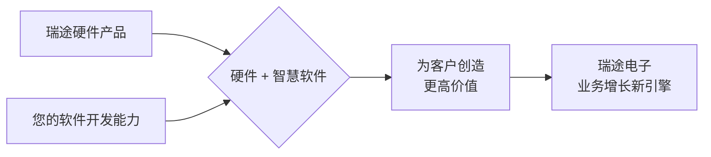

 # 抓住数字化机遇：成都瑞途电子的软件服务化转型之路

## 开篇：拥抱变革，共创未来

尊敬的成都瑞途电子领导及团队：

在制造业加速迈向数字化、智能化的浪潮中，我们深知像贵公司这样拥有坚实硬件基础的企业，正站在一个前所未有的转型升级关口。本方案旨在探讨成都瑞途电子如何依托自身在工业控制与传感硬件领域的优势，通过融合创新的软件服务，不仅提升现有产品的附加值，更能开拓全新的市场机遇，赋能您的客户实现更高效、更智能的运营。

我们相信，**"硬件的翅膀"需要"软件的智慧"来驱动**，从而飞向更广阔的蓝海。

---

## 一、数字化浪潮下的制造业新机遇

当前，全球制造业正经历深刻变革：
*   **客户需求更多样**：从标准化生产到个性化定制。
*   **市场竞争更激烈**：效率、成本、响应速度成为关键。
*   **技术发展日新月异**：物联网、大数据、人工智能不再遥不可及。

对于您的客户而言，这意味着他们迫切需要：
*   看得见的生产过程（透明化）
*   管得好的设备资产（高效化）
*   控得住的产品质量（优质化）
*   降得下的运营成本（经济化）

这正是成都瑞途电子可以大展拳脚的领域！

---

## 二、瑞途电子的独特优势：硬件为基，软件赋能

我们理解，瑞途电子在工业控制器、传感器等硬件领域拥有深厚的积累。这是我们共同构建未来的坚实基础。

**"瑞途硬件" + "智慧软件" = 为客户创造更大价值**

<!-- 建议此处可插入一张图片：左边是瑞途电子的代表性硬件产品，右边是抽象的软件/数据/云图标，中间一个加号和等号，指向客户的笑脸或成功的场景 -->

---

## 三、软件服务创新：为瑞途电子量身打造的增长引擎

基于瑞途电子的硬件优势和市场需求，我们建议聚焦以下几个方向，打造具有竞争力的软件服务：

### 1. **智能硬件升级包：让您的产品"活"起来**
   *   **业务场景**：将瑞途的控制器、传感器从"功能部件"升级为"智能终端"。
   *   **软件方案**：
        *   开发高级**嵌入式软件**：赋予硬件更强的边缘计算、数据分析、故障自诊断能力。
        *   配套**移动APP/轻应用**：客户可通过手机/平板远程查看设备状态、接收报警、调整参数。
   *   **客户价值**：购买到的不仅是硬件，更是一套便捷、智能的监控管理工具，提升操作体验和管理效率。
   *   **瑞途机遇**：提升硬件产品单价和竞争力，增加客户粘性。
   <!-- 建议此处可插入一张示意图：一个瑞途硬件产品，旁边有手机APP界面截图展示远程监控 -->

### 2. **设备联网与健康管家：您的客户的"千里眼"和"保健医"**
   *   **业务场景**：帮助使用瑞途硬件的工厂，轻松实现设备联网和基础的预测性维护。
   *   **软件方案**：
        *   搭建**轻量级IIoT数据采集与展示平台**：安全、低成本地将设备数据上传云端。
        *   提供**设备健康看板**：可视化展示设备运行工况、关键参数趋势、故障预警。
   *   **客户价值**：减少非计划停机，优化维护策略，延长设备寿命，降低运维成本。
   *   **瑞途机遇**：从一次性硬件销售，拓展到持续性的数据服务和运维支持服务。
   <!-- 建议此处可插入一张示意图：多台设备连接到云端，云端展示数据仪表盘和预警信息 -->

### 3. **生产过程"小助手"：解决车间管理"大"烦恼 (MES轻应用)**
   *   **业务场景**：针对中小型制造企业或大型企业的部分生产环节，解决特定的生产管理痛点。
   *   **软件方案**：
        *   **定制化MES模块/APP**：如生产进度实时报工、产品质量追溯（二维码/RFID）、关键工位SOP电子化、简易设备OEE统计等。
   *   **客户价值**：快速提升生产透明度，提高生产效率，保证产品质量，且投入小、见效快。
   *   **瑞途机遇**：以点带面，逐步渗透生产管理软件市场，硬件可作为天然的数据采集端。
   <!-- 建议此处可插入一张示意图：平板电脑显示生产追溯界面或OEE统计图表 -->

### 4. **智慧仓储"导航员"：让物料流动更高效 (WMS轻应用)**
   *   **业务场景**：针对有一定规模的零部件仓库或成品库，提升出入库效率和库存准确性。
   *   **软件方案**：
        *   **定制化WMS模块/APP**：如基于扫码的快速出入库、智能推荐上架库位、库存盘点助手、物料先进先出提醒等。
   *   **客户价值**：降低库存差错，提高仓库周转率，减少人工依赖。
   *   **瑞途机遇**：拓展新的应用领域，结合RFID等硬件提供一体化解决方案。
   <!-- 建议此处可插入一张示意图：仓库人员使用PDA进行扫码出入库操作 -->

### 5. **"数据魔方"服务：从数据中掘金**
    *   **业务场景**：帮助客户将瑞途硬件采集到的数据，以及其他生产数据转化为有价值的洞察。
    *   **软件方案**：
        *   提供**定制化数据分析报告**：如能耗分析、特定故障模式分析、工艺参数关联性分析等。
        *   引入**AI算法模型**（可选）：进行更深层次的故障预测、质量根因分析、工艺优化建议。
    *   **客户价值**：通过数据驱动决策，持续改进运营，发现潜在的降本增效机会。
    *   **瑞途机遇**：提供高附加值的数据分析和咨询服务，建立技术壁垒。
    <!-- 建议此处可插入一张示意图：复杂的原始数据经过分析处理，输出清晰的趋势图、诊断结论 -->

---

## 四、为何选择我们作为您的软件合作伙伴？

贵公司拥有卓越的硬件基因，我们则在软件开发领域拥有：
*   **丰富的APP与Web应用开发经验**：能为您的硬件打造用户友好的交互界面。
*   **专业的AI算法与大数据处理能力**：能深度挖掘工业数据的价值。
*   **敏捷的开发流程与快速响应能力**：能与您紧密配合，快速迭代产品。
*   **对工业场景的理解与学习意愿**：我们愿意与您一同深入客户现场，理解真实需求。

**我们将不仅仅是您的软件供应商，更是您在数字化转型道路上的技术合伙人。**

---

## 五、携手并进：我们的合作展望

我们建议从以下步骤开始我们的合作：
1.  **需求共创工作坊**：我们与瑞途的核心团队一起，深入探讨市场机会、客户痛点和瑞途的战略目标，共同筛选出1-2个最具潜力的软件服务方向作为试点。
2.  **快速原型开发与验证**：针对选定的方向，我们快速开发出最小可行性产品（MVP），并在瑞途的典型客户中进行试用和反馈收集。
3.  **迭代优化与正式推广**：根据试点反馈，持续优化软件产品，并制定详细的商业推广计划。
4.  **持续赋能与生态共建**：我们将为瑞途团队提供必要的培训，并共同探索更广泛的合作模式。

---

## 结束语：赋能硬件，智创未来！

成都瑞途电子正站在一个激动人心的历史节点。通过将硬件的精工制造与软件的智慧创新相结合，必将开辟出一条全新的增长曲线。我们期待与您携手，共同将成都瑞途电子打造成为"智能硬件+智慧服务"的行业标杆！

感谢您的时间，期待与您进一步交流！

---
**（附）建议图示参考（Mermaid简化版）**

**瑞途电子价值提升模型：**
