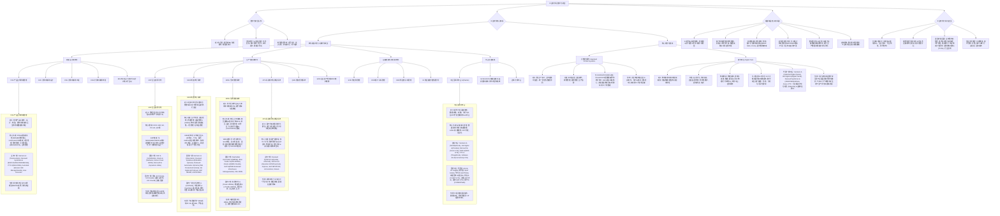

```mermaid
graph TD
    A[工业软件与数字化转型] --> B{数字化转型认知};
    A --> C{工业软件核心体系};
    A --> D{成都瑞途电子的机遇};
    A --> E{工业软件分类与选型};

    B --> B1[定义与目标: 提升效率, 创新模式, 增强竞争力];
    B --> B2[为何转型? &#40;驱动因素: 市场竞争, 客户需求个性化, 技术进步, 政策引导&#41;];
    B --> B3[转型路径思考: 顶层设计, 试点先行, 持续优化, 人才培养];

    C --> C1_Cat[按功能域划分关键软件类型];
    C --> C2_Concept[核心理念与集成];

    C1_Cat --> RD_Design[研发设计类软件];
    RD_Design --> PLM[PLM 产品生命周期管理];
    RD_Design --> CAD[CAD 计算机辅助设计];
    RD_Design --> CAE[CAE 计算机辅助工程];
    RD_Design --> CAM[CAM 计算机辅助制造];
    RD_Design --> EDA[EDA 电子设计自动化 &#40;针对电子行业&#41;];

    C1_Cat --> Production_Mgmt[生产管控类软件];
    Production_Mgmt --> ERP[ERP 企业资源计划];
    Production_Mgmt --> MES[MES 制造执行系统];
    Production_Mgmt --> WMS[WMS 仓库管理系统];
    Production_Mgmt --> APS[APS 先进规划与排程系统];
    Production_Mgmt --> QMS[QMS 质量管理系统];
    Production_Mgmt --> EAM[EAM 企业资产管理/MRO 维护维修];

    C1_Cat --> Operation_Support[运营支撑与协同类软件];
    Operation_Support --> SCM[SCM 供应链管理];
    Operation_Support --> CRM[CRM 客户关系管理];
    Operation_Support --> SRM[SRM 供应商关系管理];
    Operation_Support --> BI_Analytics[BI 商业智能与数据分析];

    C1_Cat --> Platform_Connectivity[平台与连接类];
    Platform_Connectivity --> IIoT[工业互联网平台 &#40;PaaS&#41;];
    Platform_Connectivity --> SCADA_DCS[SCADA/DCS 数据采集与监视控制系统/分布式控制系统];
    Platform_Connectivity --> EdgeComputing[边缘计算平台];

    C2_Concept --> ICS[大集控系统 Integrated Control Systems];
    ICS --> ICS_Def[定义: 整合IT与OT, 全流程集中监控、统一调度与数据协同];
    ICS --> ICS_Func[功能: 实时监控, 远程操作, 报警管理, 能源管理, 生产指挥];
    ICS --> ICS_Relation[与SCADA/DCS/MES关系: SCADA/DCS是数据来源和执行单元, MES是车间级核心, 大集控是更高层级或跨车间/工厂的集成];
    ICS --> ICS_Case[案例: 大型流程制造企业&#40;如石化、电力&#41;通过大集控中心实现多工厂集中运营];

    C2_Concept --> DT[数字孪生 Digital Twin];
    DT --> DT_Def[定义: 物理实体的动态虚拟映射, 具备数据/模型/知识驱动特性];
    DT --> DT_Value[价值: 设计优化, 仿真验证, 过程监控/预测, 预测性维护, 虚拟调试, 培训];
    DT --> DT_Elements[构建要素: 物理实体, 传感与连接, 数据, 模型&#40;几何/物理/行为/规则&#41;, 软件平台, 应用服务];
    DT --> DT_ICS_Link[与大集控/IIoT协同: IIoT/大集控提供实时数据流, 数字孪生进行建模、仿真、分析与可视化展现];
    DT --> DT_Vendors[代表厂商/平台: Siemens &#40;Industrial Digital Twin&#41;, GE Digital &#40;Digital Twin&#41;, Dassault Systèmes &#40;3DEXPERIENCE&#41;, Ansys, PTC. 行业解决方案也常见, 如Bentley &#40;基础设施&#41;];
    DT --> DT_Case[案例: 风力发电机组数字孪生用于远程监控和预测性维护; 汽车工厂产线数字孪生用于生产优化和虚拟调试];

    D --> D1[从硬件&#40;如控制器、传感器&#41;到&quot;硬件+软件+服务&quot;的转型];
    D --> D2[基于现有硬件的软件增值: 如嵌入式软件升级, 数据采集与分析应用开发];
    D --> D3[系统集成与优化服务: 帮助客户打通现有系统&#40;如ERP, MES, PLC&#41;, 提升整体效率];
    D --> D4[定制化软件开发: 针对客户特定需求的MES/WMS模块开发, 行业特定应用开发];
    D --> D5[数据分析与AI应用: 如基于设备数据的故障预测, 基于生产数据的质量分析与优化];
    D --> D6[咨询服务: 数字化转型规划, 工业软件选型与实施策略];

    E --> E1[分类标准探讨: 功能域&#40;最常用&#41;、企业层级、行业特性、技术架构];
    E --> E2[细颗粒度分类示例 &#40;已在术语解释中详述,此处不再展开&#41;];
    E --> E3[选型考量因素: 业务需求匹配度, 技术先进性与成熟度, 可扩展性, 集成能力, 供应商实力与服务, 总体拥有成本&#40;TCO&#41;, 行业案例];
    E --> E4[竞品分析维度: 功能覆盖, 技术架构, 价格, 客户口碑, 行业经验, 生态系统];

    subgraph ERP_Details [ERP 企业资源计划]
        direction LR
        ERP_Def[定义: 管理企业核心业务流程&#40;财/物/产/供/销/人&#41;]
        ERP_Func[核心模块: FI/CO, MM, SD, PP, HR, QM等]
        ERP_Integration[ERP集成: 与MES/WMS/CRM/PLM等打通数据流与业务流. 是数字化工厂的神经中枢之一.]
        ERP_Vendors_Global[国际厂商: SAP &#40;S/4HANA&#41;, Oracle &#40;NetSuite, Fusion Cloud ERP&#41;, Microsoft &#40;Dynamics 365&#41;]
        ERP_Vendors_Local[国内厂商: 用友 &#40;YonSuite, U9 Cloud&#41;, 金蝶 &#40;苍穹, K/3 Cloud&#41;,浪潮,鼎捷]
        ERP_Case_Example[案例: 装备制造企业ERP实现项目制造精细化成本与供应链协同.]
    end
    ERP --> ERP_Details;

    subgraph MES_Details [MES 制造执行系统]
        direction LR
        MES_Def[定义: 连接计划层与控制层,管理车间从订单到成品的执行过程]
        MES_Func[核心功能: 生产调度, 过程控制, 质量管理, 设备管理&#40;OEE&#41;, 物料追溯, 数据采集, 人员管理, 在制品管理]
        MES_Custom[MES定制: 针对特定行业&#40;如电子、汽车、医药GMP&#41;的合规性要求、独特工艺流程、设备接口、报表等进行个性化开发.]
        MES_Vendors_Global[国际厂商: Siemens &#40;Opcenter&#41;, Dassault Systèmes &#40;DELMIA Apriso&#41;, Rockwell Automation &#40;FactoryTalk ProductionCentre&#41;, GE Digital &#40;Proficy&#41;, SAP ME/MII, AVEVA MES]
        MES_Vendors_Local[国内厂商: 宝信软件 &#40;xIn3Plat&#41;, 中控技术 &#40;SupOS&#41;, 盘古信息, 摩尔元数, 黑湖科技, 华磊迅拓等]
        MES_Case_Example[案例: 汽车零部件厂MES实现JIT/JIS, 提OEE, 严格追溯.]
    end
    MES --> MES_Details;

    subgraph WMS_Details [WMS 仓库管理系统]
        direction LR
        WMS_Def[定义: 优化仓库作业&#40;入库/出库/库存/盘点&#41;,提升效率与准确性]
        WMS_Func[核心功能: 收货/上架策略, 拣货策略&#40;波次/订单/RF&#41;, 补货, 盘点, 库位管理, RF作业, 与自动化设备&#40;AGV/ASRS&#41;集成]
        WMS_Custom[WMS定制: 针对仓库布局、SKU特性、自动化程度、温控/批次等特殊管理需求进行定制. 与TMS/OMS集成.]
        WMS_Vendors_Global[国际厂商: Manhattan Associates &#40;WMS&#41;, Blue Yonder &#40;JDA WMS&#41;, Oracle &#40;WMS Cloud&#41;, SAP &#40;EWM Extended Warehouse Management&#41;, Infor WMS]
        WMS_Vendors_Local[国内厂商: 科箭软件 &#40;Power WMS&#41;, 唯智信息 &#40;vTradEx WMS&#41;, 网仓科技, 心怡科技, 巨沃]
        WMS_Case_Example[案例: 电商配送中心WMS+自动化高效拣选发货, 库存准确率99.9%.]
    end
    WMS --> WMS_Details;

    subgraph PLM_Details [PLM 产品生命周期管理]
        direction LR
        PLM_Def[定义: 管理产品从概念、设计、制造、服务到报废的全生命周期数据和流程]
        PLM_Func[核心功能: PDM&#40;数据/文档/BOM/变更管理&#41;, CAD/CAE/CAM集成, 项目管理, 需求管理, 工艺管理&#40;MBOM/BOP&#41;, 合规管理]
        PLM_Vendors[主流厂商: Siemens &#40;Teamcenter&#41;, Dassault Systèmes &#40;ENOVIA/3DEXPERIENCE&#41;, PTC &#40;Windchill&#41;, Autodesk &#40;Fusion 360 Manage/Vault&#41;, Aras Innovator]
        PLM_Case_Example[案例: 航空航天企业PLM管理复杂BOM/变更, 协同供应商.]
    end
    PLM --> PLM_Details;

    subgraph APS_Details [APS 先进规划与排程系统]
        direction LR
        APS_Def[定义: 基于约束理论和优化算法, 进行中长期生产计划和短期详细排程]
        APS_Func[核心功能: 有限产能排程, 多工厂计划, 需求预测与S&OP支持, 物料约束, 优化目标&#40;如交期/成本/换型&#41;]
        APS_Vendors[主流厂商: Dassault Systèmes &#40;Quintiq, Ortems&#41;, Siemens &#40;Opcenter APS/Preactor&#41;, Asprova, SAP IBP/PP/DS, o9 Solutions, Kinaxis]
        APS_Case_Example[案例: 定制家具厂APS应对个性化订单, 缩短周期, 提高设备利用率.]
    end
    APS --> APS_Details;

    subgraph IIoT_Details [工业互联网平台]
        direction LR
        IIoT_Def[定义: 提供工业设备连接、数据采集、存储、分析与工业APP开发部署的PaaS平台]
        IIoT_Func[核心功能: 设备接入/管理, 数据湖/时序库, 数据建模, AI/ML库, 微服务, APP开发, 可视化]
        IIoT_Vendors_Global[国际平台: Siemens &#40;MindSphere&#41;, GE Digital &#40;Predix&#41;, Microsoft &#40;Azure IoT&#41;, AWS &#40;AWS IoT&#41;, PTC &#40;ThingWorx&#41;, Software AG &#40;Cumulocity IoT&#41;]
        IIoT_Vendors_Local[国内平台: 阿里云 &#40;Link IoT Edge&#41;, 腾讯云 &#40;IoT Hub&#41;, 华为云 &#40;IoTDA&#41;, 树根互联 &#40;根云&#41;, 用友 &#40;YonBIP IoT&#41;, 浪潮 &#40;云洲&#41;, 美的 &#40;M.IoT&#41;, 海尔 &#40;COSMOPlat&#41;]
        IIoT_Case_Example[案例: 工程机械远程监测、故障诊断、预测性维护, 开拓服务收入.]
    end
    IIoT --> IIoT_Details;
```