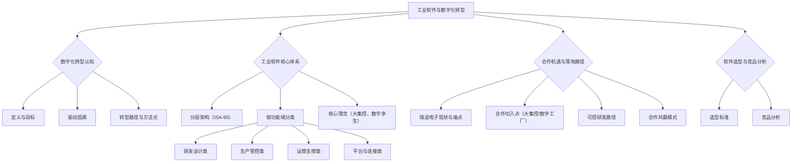

# 工业软件与数字化转型详解（精华版）

## 引言

本报告面向互联网开发团队，帮助快速理解工业软件与数字化转型的核心脉络，聚焦于如何与中国传统制造业企业（如成都瑞途电子）合作，切入大集控/数字化工厂软件市场，实现双方共赢，并兼顾研发投入的可控性。

---

## 一、行业趋势与数字化转型必要性
- 全球制造业数字化转型加速，软件价值占比持续提升。
- 中国政策大力推动智能制造、工业互联网、数字工厂。
- 中国传统制造业企业面临"硬件+软件+服务"一体化转型压力。

---

## 二、工业软件体系树状结构

---

## 三、ISA-95分层与大集控定位

- **L0/L1：** 传感器、PLC、控制器（瑞途电子强项）
- **L2：** SCADA/HMI/边缘计算（数据采集与监控）
- **L3：** MES/APS/QMS（生产运营管理）
- **L4：** ERP/PLM/SCM（企业管理）
- **大集控：** 跨L2-L3-L4，集成多系统，实现集中监控、统一调度、数据协同，是软件增值的关键切入点

---

## 四、瑞途电子合作机遇与落地路径

### 4.1 现状与痛点
- 以硬件为主，软件短板导致客户软件合同流失
- 客户对"硬件+软件+服务"一体化有强需求
- 缺乏大集控/数字工厂整体方案能力

### 4.2 合作切入点
- **大集控/数字工厂软件方案联合开发**：我们提供软件平台/架构/集成能力，瑞途电子提供硬件与客户资源
- **轻量级、可快速交付的模块**：如数据采集中台、设备监控APP、简易SCADA、OEE分析、可视化看板等，优先满足客户刚需，研发投入可控
- **标准化+定制化结合**：核心平台标准化，行业/客户特性可插件化扩展

### 4.3 合作共赢模式
- 联合品牌/联合交付，提升瑞途电子整体方案竞争力
- 软件平台可按项目/模块/用户数授权，分成或服务费灵活
- 研发投入分阶段、可控，先做MVP（最小可用产品），快速试点，逐步扩展

---

## 五、数字化转型落地建议
- 以"硬件+软件+服务"整体方案为目标，逐步推进
- 先做数据采集/设备监控等刚需模块，快速见效
- 逐步拓展到大集控、MES、数据分析等高附加值软件
- 积累行业Know-how，形成可复制的产品/解决方案
- 积极引入AI/数据分析等新技术，提升产品竞争力

---

## 六、典型案例（精选）
- **案例1：某自动化公司与软件团队合作，联合交付大集控平台**
  - 硬件方提供PLC/传感器/现场集成，软件方开发SCADA+数据中台+可视化，客户只需对接一家公司，整体方案竞争力大幅提升。
- **案例2：轻量级设备监控APP快速落地**
  - 先做设备数据采集+可视化，后续逐步扩展到OEE分析、远程运维、AI预测性维护。

---

## 七、软件选型与竞品分析（要点）
- 选型标准：业务需求匹配、集成能力、可扩展性、实施成本、服务能力
- 竞品分析：功能覆盖、技术架构、行业经验、价格模式、生态合作

---

## 八、结论与行动建议
- 瑞途电子与我们合作，可快速补齐软件短板，提升整体方案竞争力
- 先做MVP试点，快速交付，降低研发风险
- 逐步形成标准化产品，打造行业标杆案例，实现双方共赢

---

┌───────────────┬──────────────────────────────┬──────────────────────────────┬──────────────────────────────┐
│ 层级         │ 典型系统/功能                │ 瑞途电子现有产品             │ 我们可合作方向               │
├───────────────┼──────────────────────────────┼──────────────────────────────┼──────────────────────────────┤
│ L4 企业管理   │ ERP/PLM/SCM/BI               │                              │ 数据接口/BI/轻量ERP          │
├───────────────┼──────────────────────────────┼──────────────────────────────┼──────────────────────────────┤
│ L3 制造运营   │ MES/APS/QMS/WMS              │                              │ 轻量MES/生产看板/OEE         │
├───────────────┼──────────────────────────────┼──────────────────────────────┼──────────────────────────────┤
│ L2 过程监控   │ SCADA/HMI/边缘计算            │                              │ SCADA平台/数据中台/可视化    │
├───────────────┼──────────────────────────────┼──────────────────────────────┼──────────────────────────────┤
│ L1 控制层     │ PLC/DCS/RTU/控制器            │ PLC/控制器                   │ 组态软件/远程运维/固件升级   │
├───────────────┼──────────────────────────────┼──────────────────────────────┼──────────────────────────────┤
│ L0 现场设备   │ 传感器/执行器/智能仪表        │ 传感器/部分执行器            │ 边缘算法/数据采集固件        │
└───────────────┴──────────────────────────────┴──────────────────────────────┴──────────────────────────────┘